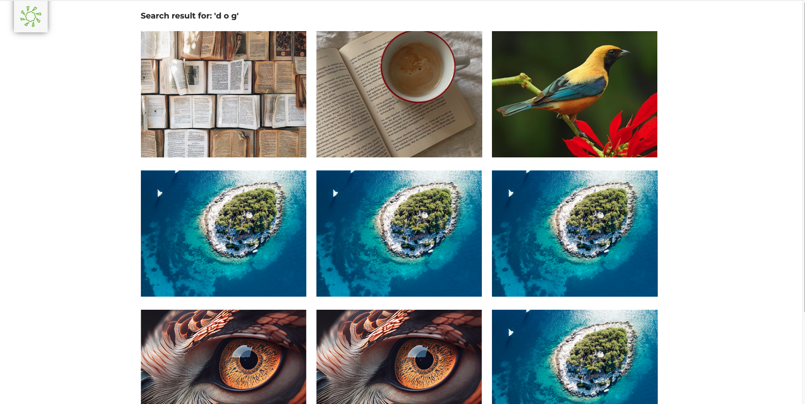
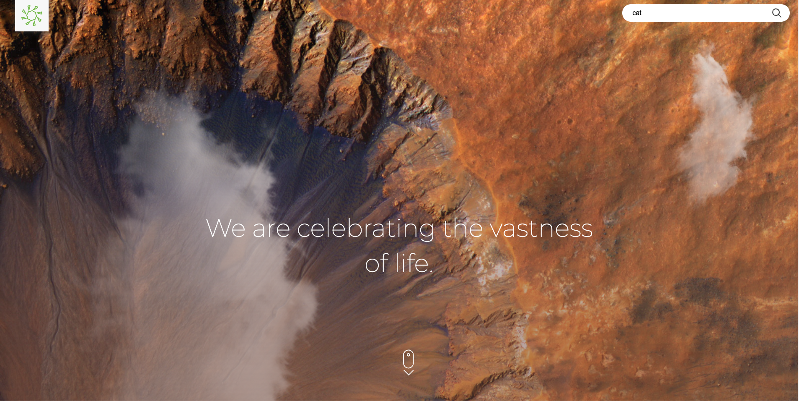
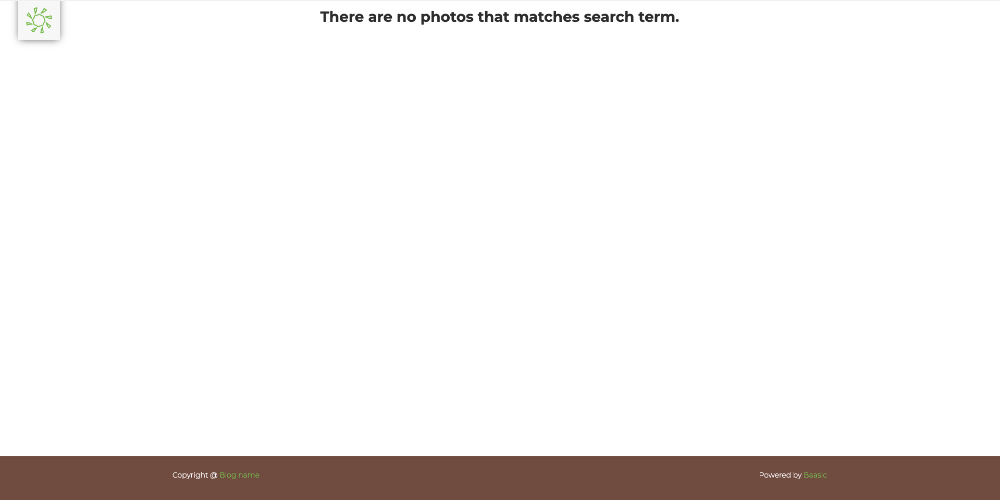
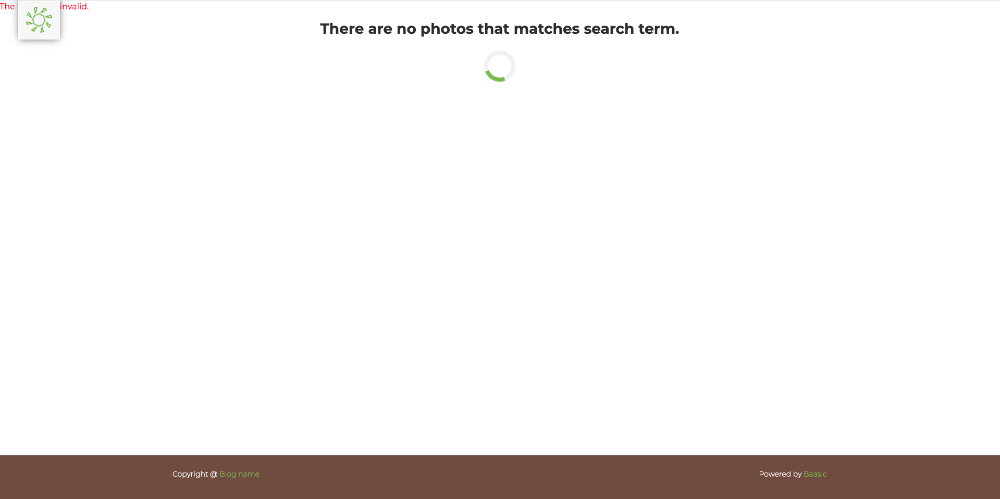
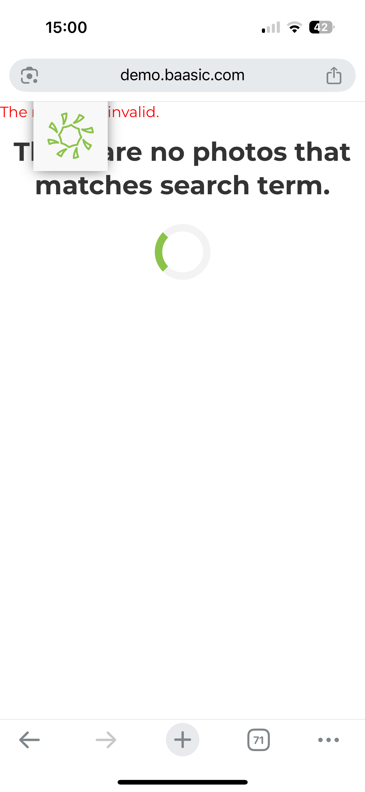
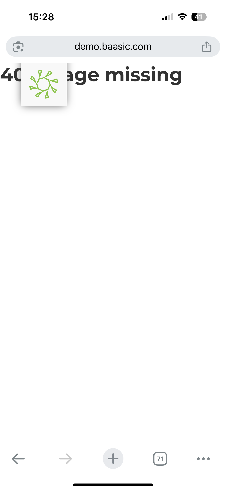

### **Bug Title:** 
*1. Spacing in word search*  

### **Steps to Reproduce:**
1.	Open a supported web browser
2.	Open site http://demo.baasic.com/angular/starterkit-photo-gallery/main
3.	Click search button in upper right corner
4.	Write name of photo with spacing between letters

### **Expected Result:**  
Photos should not be displayed when having space between letters  

### **Actual Result:**  
All photos are displayed when a space is entered between letters.  

### **Screenshot/Video:**  
 

### **Environment:**  
- **Browser:** Chrome Version 139.0.7258.139
- **OS:** macOS 15.6.1 (24G90)  

### **Severity:** Medium  
### **Priority:** Medium  

---
---
### **Bug Title:** 
*2. Search button click does not trigger search*  

### **Steps to Reproduce:**
1.	Open a supported web browser
2.	Open site http://demo.baasic.com/angular/starterkit-photo-gallery/main
3.	Click search button in upper right corner
4.	Type a valid keyword
5.  Click on the search arrow/icon instead of pressing Enter.

### **Expected Result:**  
Search should be executed when the user clicks on the search icon.

### **Actual Result:**  
Nothing happens when clicking the search icon; search only works when pressing Enter.  

### **Screenshot/Video:**  
[Watch video demonstration](./videos/search-arrow-bug.mp4) 

### **Environment:**  
- **Browser:** Chrome Version 139.0.7258.139
- **OS:** macOS 15.6.1 (24G90)  

### **Severity:** Medium  
### **Priority:** Medium  

---
---

### **Bug Title:** 
*3. Search button disappear*  

### **Steps to Reproduce:**
1.	Open a supported web browser
2.	Open site http://demo.baasic.com/angular/starterkit-photo-gallery/main
3. Type a keyword  
4. When the dropdown list with previous search terms appears, click with the mouse over one of the suggested terms.  
6. Observe the search icon and the search button.

### **Expected Result:**  
The search icon and button should remain active when hovering or selecting a previously searched term.  
The user should be able to click on the icon or the selected term to trigger a new search.

### **Actual Result:**  
When clicking with the mouse on a previous search term in the dropdown, the search icon disappears and the search button becomes disabled (greyed out).  
The user must press Enter manually to perform the search. 

### **Screenshot/Video:**  
[Watch video demonstration](./videos/search-arrow-disappear.mp4) 

### **Environment:**  
- **Browser:** Chrome Version 139.0.7258.139
- **OS:** macOS 15.6.1 (24G90)  

### **Severity:** Medium  
### **Priority:** Medium  

---
---

### **Bug Title:** 
*4. Search button disappears when selecting a previous search term keyboard*  

### **Steps to Reproduce:**
1.	Open a supported web browser
2.	Open site http://demo.baasic.com/angular/starterkit-photo-gallery/main
3. Type a keyword  
4. Use the "Down Arrow key" on the keyboard to select one of the previous search terms.  
7. Observe the search icon and button state.

### **Expected Result:**  
The search icon and button should remain visible and active when selecting a previous search term using keyboard.  

### **Actual Result:**  
When selecting with arrow keys a previous search term, the search icon disappears and the search button becomes inactive (greyed out).  
The search can only be executed by pressing Enter. 

### **Screenshot/Video:**  
[Watch video demonstration](./videos/search-arrow-key.mp4) 

### **Environment:**  
- **Browser:** Chrome Version 139.0.7258.139
- **OS:** macOS 15.6.1 (24G90)  

### **Severity:** Medium  
### **Priority:** Medium  

---
---

### **Bug Title:** 
*5. Search bar collapses and search icon disappears when clicking outside after selecting a search term*  

### **Steps to Reproduce:**
1.	Open a supported web browser
2.	Open site http://demo.baasic.com/angular/starterkit-photo-gallery/main
3. Type a keyword  
4. Select a term from the dropdown list (using mouse or keyboard).  
5. Then, move the mouse away and click anywhere outside the search field (e.g., on empty page space).  
6. Observe what happens to the search bar and icon.

### **Expected Result:**  
The search bar should remain expanded and visible even after clicking outside the field.  
The search icon (arrow) should remain visible and clickable to perform a new search at any time.  

  

### **Actual Result:**  
After clicking outside the search bar, the field collapses and the search icon disappears.  

### **Screenshot/Video:**  
[Watch video demonstration](./videos/search-clicking-outside.mp4) 

### **Environment:**  
- **Browser:** Chrome Version 139.0.7258.139
- **OS:** macOS 15.6.1 (24G90)  

### **Severity:** Medium  
### **Priority:** Medium  

---
---

### **Bug Title:** 
*6. Search with spacing before first letter*  

### **Steps to Reproduce:**
1.	Open a supported web browser (Chrome, Firefox, Edge)
2.	Click https://demo.baasic.com/angular/starterkit-photo-gallery/main
3.	Click the search button located in the upper right corner
4.	Enter the name of a photo that exists and contains spacing before the word
5.	Press enter

### **Expected Result:**  
When the user adds spaces before the search term, the application should ignore the extra whitespace and correctly display all photos that correspond to the searched word. 

### **Actual Result:**  
Photos do not appear in the gallery after performing the search.

### **Screenshot/Video:**  

### **Environment:**  
- **Browser:** Chrome Version 139.0.7258.139
- **OS:** macOS 15.6.1 (24G90)  

### **Severity:** Medium  
### **Priority:** Medium  

---
---

### **Bug Title:** 
*7. After fourth search, the page fails to load results and keeps spinning*  

### **Steps to Reproduce:**
1.	Open a supported web browser
2.	Open site http://demo.baasic.com/angular/starterkit-photo-gallery/main
3. Perform a search with any valid keyword.  
4. Repeat the search with more keywords.  
5. On the fourth search attempt, observe the page behavior.

### **Expected Result:**  
Each search should load and display the matching gallery images normally, regardless of how many times the search has been performed.  
  

### **Actual Result:**  
After approximately every fourth search, the gallery stops loading and the loading spinner continues indefinitely.  
No new images are displayed, and the page does not recover until manually refreshed. 

### **Screenshot/Video:**  
[Watch video demonstration](./videos/gallery-loading-bug.mp4) 

### **Environment:**  
- **Browser:** Chrome Version 139.0.7258.139
- **OS:** macOS 15.6.1 (24G90)  

### **Severity:** Medium  
### **Priority:** Medium  

---
---

### **Bug Title:** 
*8. Gallery does not load automatically when navigating back to Home from another page*  

### **Steps to Reproduce:**
1.	Open a supported web browser
2. Click on the Menu in the top navigation bar.  
3. Select Login from the dropdown menu.  
4. Once the Login page opens, click on the Home icon in the top-left corner to return to the homepage.

5. Observe the gallery section.

### **Expected Result:**  
When clicking the Home icon, the photo gallery should load automatically and display all available images without any additional interaction.  

### **Actual Result:**  
After returning to Home from the Login page, the user must click and manually scroll down to the gallery icon at the bottom of the page for the images to appear.   

### **Screenshot/Video:**  
[Watch video demonstration](./videos/gallery-load-bug.mp4)  

### **Environment:**  
- **Browser:** Chrome Version 139.0.7258.139
- **OS:** macOS 15.6.1 (24G90)  

### **Severity:** Low  
### **Priority:** Medium  
---
---
### **Bug Title:** 
*9. Gallery image appears visually split after tapping the bottom Gallery button on mobile*  

### **Steps to Reproduce:**
1. Open https://demo.baasic.com/angular/starterkit-photo-gallery/main .
2. On the home screen, tap the Gallery button at the bottom of the page.
3. Scroll slightly and observe the background image.

### **Expected Result:**  
The background image should remain fully visible.  

### **Actual Result:**  
After tapping the Gallery button, the background image appears visually split — a visible horizontal break/cut appears across the image, as shown in the screenshot.

### **Screenshot/Video:**  

### **Environment:**  
- **Browser:** Chrome 
- **OS:** iOS 18.5 (Iphon 14 Pro)

### **Severity:** Low  
### **Priority:** Low  
---
---

### **Bug Title:** 
*10. Search with only a space*  

### **Steps to Reproduce:**
1. Open https://demo.baasic.com/angular/starterkit-photo-gallery/main .
2. On the home screen, tap the Gallery button at the bottom of the page.
3. Click the Search icon in the top-right.
4. In the search field, type a single space (“ ”).
5. Press Enter.

### **Expected Result:**  
The system should ignore empty/whitespace-only input and not trigger a search.

### **Actual Result:**  
A search is triggered with a blank term: the page shows “There are no photos that matches search term.” and a loading spinner is visible in the center.

### **Screenshot/Video:**  

### **Environment:**  
- **Browser:** Chrome , Chrome Version 139.0.7258.139
- **OS:** iOS 18.5 (Iphon 14 Pro), macOS 15.6.1 (24G90)
 

### **Severity:** Low  
### **Priority:** Low  
---
---

### **Bug Title:** 
*11. Search with special characters*  

### **Steps to Reproduce:**
1. Open https://demo.baasic.com/angular/starterkit-photo-gallery/main .
2. On the home screen, tap the Gallery button at the bottom of the page.
3. Click the Search icon in the top-right.
4. In the search field, enter special character: "/"
5. Press Enter

### **Expected Result:**  
If there are photos whose titles or tags contain these characters (e.g., /), the matching photos should be displayed or message “There are no photos that match the search term.”

### **Actual Result:**  
“404: Page Missing” error instead of displaying relevant images

### **Screenshot/Video:**  

### **Environment:**  
- **Browser:** Chrome , Chrome Version 139.0.7258.139
- **OS:** iOS 18.5 (Iphon 14 Pro), macOS 15.6.1 (24G90)
 

### **Severity:** Medium  
### **Priority:** Medium  

### **Bug Title:** 
*12. Closing a photo preview (X button)*  

### **Steps to Reproduce:**
1. Open https://demo.baasic.com/angular/starterkit-photo-gallery/main .
2. Navigate to the Gallery section.  
3. Click on any photo to open it in full-screen or detailed view.  
4. Click the X (close) button in the top-right corner of the photo preview.  
5. Observe where the user is redirected.

### **Expected Result:**  
After clicking the X button, the photo preview should close, nd the user should return to the gallery view.

### **Actual Result:**  
When clicking X, the user is redirected to the main home page, instead of returning to the gallery view.

### **Screenshot/Video:**  

### **Environment:**  
- **Browser:** Chrome Version 139.0.7258.139
- **OS:**  macOS 15.6.1 (24G90)
 

### **Severity:** Medium  
### **Priority:** Medium  

-- 
--

### **Bug Title:** 
*13. Registration error*  

### **Steps to Reproduce:**
1. Open https://demo.baasic.com/angular/starterkit-photo-gallery/main .
2. In upper left corner click “Menu” then “Register”.
3. Click on every input field so every input field shows error message that field is required.
4. Write correct data in every input field.
5. Click button “Register”

### **Expected Result:**  
The system should register the user successfully once all fields are correctly filled.

### **Actual Result:**  
After filling in all valid data and clicking Register, the registration fails, even though all required fields are valid.

### **Screenshot/Video:**  

### **Environment:**  
- **Browser:** Chrome Version 139.0.7258.139
- **OS:**  macOS 15.6.1 (24G90)
 

### **Severity:** Medium  
### **Priority:** High  

-- 
--
### **Bug Title:** 
*14. Navigating from Register to Home keeps page loading — gallery does not appear*  

### **Steps to Reproduce:**
1.	Open a supported web browser
2. In the top navigation bar, open Menu then Register.  
3. Click on every input field so every input field shows error message that field is required..  
4. Open the Menu again and click Home.  
5. Observe the homepage behavior.

### **Expected Result:**  
When clicking the Home icon, the photo gallery should load automatically and display all available images without any additional interaction.  

### **Actual Result:**  
After navigating back to Home, the page stays in a loading state — the spinner keeps spinning indefinitely.

### **Screenshot/Video:**  
[Watch video demonstration](./videos/registration-menu-error.mp4)  

### **Environment:**  
- **Browser:** Chrome Version 139.0.7258.139
- **OS:** macOS 15.6.1 (24G90)  

### **Severity:** High  
### **Priority:** Medium  
---

### **Bug Title:** 
*15. Password recovery form does not respond* 

### **Steps to Reproduce:**
1. Open https://demo.baasic.com/angular/starterkit-photo-gallery/main .
2. In upper left corner click “Menu” then “Login”.
3. Click “Forgot Your Password? Recover Your Password Here!”
4. Enter your valid email address.
5. Click “Recover password” button

### **Expected Result:**  
A valid password recovery email should be sent to the entered address, containing a working recovery link.

### **Actual Result:**  
The message “Please check your email in order to finish the password recovery process.” is displayed in red text, which may misleadingly suggest an error.
After clicking the link from the received email, the user is redirected to a nonexistent page (Error 404).

### **Screenshot/Video:**  

### **Environment:**  
- **Browser:** Chrome Version 139.0.7258.139
- **OS:**  macOS 15.6.1 (24G90)
 

### **Severity:** High 
### **Priority:** High  

--
--

### **Bug Title:** 
*16. Social login options* 

### **Steps to Reproduce:**
1. Open https://demo.baasic.com/angular/starterkit-photo-gallery/main .
2. In upper left corner click “Menu” then “Login”.
3. In the upper left corner, click Menu then Login.  
4. Click on the Social Login section on the right side of the login page.

### **Expected Result:**  
Social login buttons (Facebook, Twitter, Google, GitHub) should be functional and lead to  the correct social media page.

### **Actual Result:**  
An error message appears below the social login icons: “undefined: Social login configuration not found.”

### **Screenshot/Video:**  

### **Environment:**  
- **Browser:** Chrome Version 139.0.7258.139
- **OS:**  macOS 15.6.1 (24G90)
 

### **Severity:** Medium 
### **Priority:** Medium 

--
--

### **Bug Title:** 
*17. Photo titles containing special characters (č, ć, ž, š, đ) are not displayed correctly after upload* 

### **Steps to Reproduce:**
1. Open https://demo.baasic.com/angular/starterkit-photo-gallery/main .
2. In upper left corner click “Menu” then “Login”.
3. In the upper left corner, click Menu then Login.  
4. Click button “Login”
5. Click on existing album
6. Upload photo that has some of č, ć, ž, š, đ letters in the name

### **Expected Result:**  
The photo title should display the full name, including all special characters (č, ć, ž, š, đ).
### **Actual Result:**  
The uploaded photo title misses the o special characters
### **Screenshot/Video:**  

### **Environment:**  
- **Browser:** Chrome Version 139.0.7258.139
- **OS:**  macOS 15.6.1 (24G90)
 

### **Severity:** Medium 
### **Priority:** Medium 

--

### **Bug Title:** 
*18. Wrong validation message* 

### **Steps to Reproduce:**
1. Open https://demo.baasic.com/angular/starterkit-photo-gallery/main .
2. Log in to the application using valid credentials.
3. Open the Menu and go to the Profile page.
4. Click the Upload Photo button.
5. Select an image file that is 15MB or larger.
6. Click Upload and observe the system behavior.

### **Expected Result:**  
The image should not be uploaded or displayed in the profile preview.

### **Actual Result:**  
The system displays a wrong validation message  “Username is taken” instead of an image size error.

### **Screenshot/Video:**  

### **Environment:**  
- **Browser:** Chrome Version 139.0.7258.139
- **OS:**  macOS 15.6.1 (24G90)
 

### **Severity:** Medium  
### **Priority:** Medium  

--
--

### **Bug Title:** 
*19. Album photo count does not update after uploading a new photo* 

### **Steps to Reproduce:**
1. Open https://demo.baasic.com/angular/starterkit-photo-gallery/main .
2. Log in to the application using valid credentials.
2. In the upper left corner, click Menu → Login and log in with valid credentials.  
3. Open an existing album.  
5. Upload a new photo to the album.

### **Expected Result:**  
After a successful upload, the album’s photo count should immediately update to reflect the new number of photos.

### **Actual Result:**  
After uploading a new photo, the album still displays the old photo count. 

### **Screenshot/Video:**  
[Watch video demonstration](./videos/wrong-number-photos.mp4) 

### **Environment:**  
- **Browser:** Chrome Version 139.0.7258.139
- **OS:**  macOS 15.6.1 (24G90)
 

### **Severity:** Medium  
### **Priority:** Medium  

### **Bug Title:** 
*20. Opening the first uploaded album returns a 404 error* 

### **Steps to Reproduce:**
1. Open https://demo.baasic.com/angular/starterkit-photo-gallery/main .
2. Log in to the application using valid credentials.
3. Navigate to the Profile page.
4. Click on the first created album

### **Expected Result:**  
The album should open and display its content.

### **Actual Result:**  
When clicking to open the first uploaded album, the application redirects to a blank page with an Error 404 – Page missing.

### **Screenshot/Video:**  

### **Environment:**  
- **Browser:** Chrome Version 139.0.7258.139
- **OS:**  macOS 15.6.1 (24G90)
 

### **Severity:** High  
### **Priority:** Medium  

--
--

### **Bug Title:** 
*21. Red border around email input field displayed on Login page before any user interaction.* 

### **Steps to Reproduce:**
1. Open https://demo.baasic.com/angular/starterkit-photo-gallery/main.
2. Open the menu in the upper left corner.
3. Click on “Login”.

### **Expected Result:**  
Login input fields (username and password) should appear with a neutral border color

### **Actual Result:**  
The username input field is displayed with a red border immediately upon loading the page, suggesting an error state even though no user interaction occurred.

### **Screenshot/Video:**  

### **Environment:**  
- **Browser:** Chrome Version 139.0.7258.139
- **OS:**  macOS 15.6.1 (24G90)
 

### **Severity:** Medium  
### **Priority:** Medium  

--
--
### **Bug Title:** 
*22. Incorrect cursor type when hovering over input fields on the Login page.*

### **Steps to Reproduce:**
1. Open https://demo.baasic.com/angular/starterkit-photo-gallery/main 
2. Open the menu in the upper left corner.
3. Click on “Login”.  
4. Move the mouse cursor over the input fields (e.g., “Enter your email or username”, “Password”).

### **Expected Result:**  
When hovering over an input field, the mouse cursor should change to the text selection (I-beam) style, indicating that the user can type in the field.  

### **Actual Result:**  
When hovering over an input field, the mouse cursor is a pointer (hand icon) instead of the text selection style.  

### **Screenshot/Video:**  
[Watch video demonstration](./videos/Incorrect-curso.mp4)  

### **Environment:**  
- **Browser:** Chrome Version 139.0.7258.139
- **OS:**  macOS 15.6.1 (24G90)
 

### **Severity:** Medium  
### **Priority:** Medium  

--